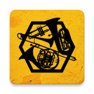

# Brass Routines

A React Native app that is a convenient pocket reference for orchestral excerpts, and auditions. This app contains all major brass excerpts, and current job listings, as well as information about the composers. There is also a function that allows the user to randomize excerpts, and save excerpts as favorites.

available on the <a href="https://apps.apple.com/us/app/brass-routines/id1511172029">Apple App Store</a>, <a href="https://play.google.com/store/apps/details?id=com.brassroutines">Google Play Store</a>, and the <a href="https://www.amazon.com/Alexander-Burdiss-Brass-Routines/dp/B08X75XT4P">Amazon App Store</a>.

## Requirements

- iOS 12.4+
- Android SDK 21 (Android 5.0 Lollipop)

## Contributing

If you have feature requests or bug reports, feel free to help out by sending pull requests or by [creating new issues](https://github.com/aburdiss/BrassRoutines/issues/new).

## License

"Brass Routines" is released under the MIT license. See [LICENSE](LICENSE) for details.
